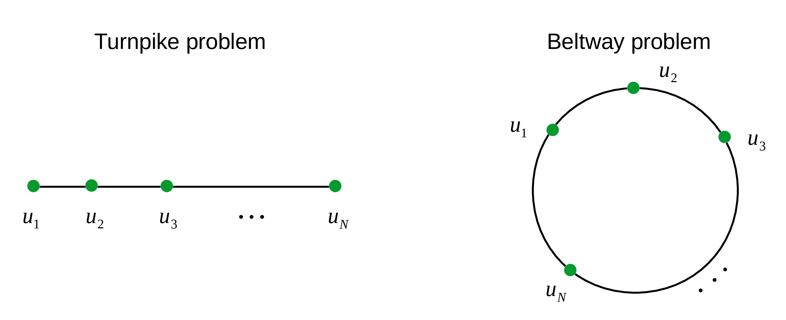

# Solving the noisy turnpike and beltway problems
* The `turnpike` problem, also known as the `partial digest` problem, tries to reconstruct the locations of a set of points that lie on a **`line`** from their unassigned pairwise diatances.
* The `beltway` problem tries to reconstruct the locations of a set of points that lie on a **`loop`** from their unassigned pairwise diatances.

* This package contains code files to implement the approach described in the following paper.
```
@article{DBLP:journals/corr/abs-1804-02465,
    author    = {Shuai Huang and Ivan Dokmanic},
    title     = {Reconstructing Point Sets from Distance Distributions},
    journal   = {CoRR},
    volume    = {abs/1804.02465},
    year      = {2018},
    url       = {http://arxiv.org/abs/1804.02465},
    archivePrefix = {arXiv},
    eprint    = {1804.02465},
    timestamp = {Mon, 13 Aug 2018 16:47:54 +0200},
    biburl    = {https://dblp.org/rec/bib/journals/corr/abs-1804-02465},
    bibsource = {dblp computer science bibliography, https://dblp.org}
}
```
If you use this package and find it helpful, please cite the above paper. Thanks :smile:

## Summary
```
    ./turnpike          -- This folder contains files and instructions to solve the turnpike problem.
    ./partial_digestion -- This folder contains files and instructions to run the partial digestion experiment.
    ./beltway           -- This folder contains files and instructions to solve the beltway problem.
    ./monte_carlo       -- Thi folder contains files and instructions to run the Monte Carlo simulations.
```
## Usage

Please open each folder for detailed instructions :smile:
   
