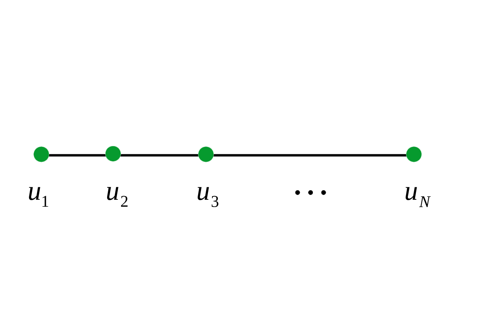

# Solving the noisy turnpike problem

* This problem is known as `the turnpike problem` or `the partial digest problem`. It tries to reconstruct the locations of a set of points that lie on a **`line`** from their unassigned pairwise diatances.


* This package contains code files to implement the approach described in the following paper.
```
@article{DBLP:journals/corr/abs-1804-02465,
    author    = {Shuai Huang and Ivan Dokmanic},
    title     = {Reconstructing Point Sets from Distance Distributions},
    journal   = {CoRR},
    volume    = {abs/1804.02465},
    year      = {2018},
    url       = {http://arxiv.org/abs/1804.02465},
    archivePrefix = {arXiv},
    eprint    = {1804.02465},
    timestamp = {Mon, 13 Aug 2018 16:47:54 +0200},
    biburl    = {https://dblp.org/rec/bib/journals/corr/abs-1804-02465},
    bibsource = {dblp computer science bibliography, https://dblp.org}
}
```
If you use this package and find it helpful, please cite the above paper. Thanks :smile:

## Summary
```
    ./m_file            -- This folder contains MATLAB files that are used to create the datset, and to extract point locations
    ./src               -- This folder contains C++ files that are used to perform the reconstruction using the proposed approach
    ./eigen-eigen-3.3.7 -- This folder contains the C++ Eigen library, it is included here for your convenience
    ./opt               -- This folder contains option files for the main program
    ./backtrack         -- This folder contains C++ files for the backtracking approach
    ./data              -- This folder contains the dataset
    ./output            -- This folder contains the output of the main program
```

## Usage

You can follow the following steps to run the program.

* Step 1) Create the datasets. Open `MATLAB` and type the following commands into the console:
```
    >> addpath(genpath('./m_file'))
    >> create_noisy_turnpike_10;    % create a random trial with 10 points to recover, and add vaying levels of noise to the distances. Please refer to the file for details
    >> create_noisy_turnpike_100;   % create a random trial with 100 points to recover
```

* Step 2) Compile the C++ program
```
    g++ -std=c++11 -fopenmp -O3 -o main ./src/main.cpp ./src/DataReader.cpp ./src/uDGP.cpp ./src/SED.cpp ./src/global.cpp -I ./eigen-eigen-3.3.7 -pthread
    g++ -std=c++11 -O3 -o ./backtrack/PDP ./backtrack/PDP.cpp
```

* Step 3) Recover 10 points from their noisy unassigned pairwise distances using the proposed approach.
```    
    ./run_main_turnpike_10.sh
```
Take the option file `opt/main_options_cont_s_1d_10_1_res1` for example, it contains the following options:
```
    num_thread      --  The number of threads used for computation
    num_smp         --  The number of points to be recovered
    max_ite         --  The maximum number of iterations for the projected gradient descent
    max_sg_ite      --  The maximum number of iterations when computing the spectral initializer using the power method
    min_space_unit  --  The quantization step chosen to discretize the 1D domain space, usually set to a tenth of the minimum distance between two differnet points
    sigma           --  The standard deviation of the Gaussian distribution we use to convolve with the distance measurements.
    tau             --  The maximum deviation of a noisy distance from the noiseless distance, also known as the error range. It should be at least 3 times of sigma. Setting it to be 5 times of sigma would contain 99.9999% of the error.
    perturb_std     --  The standandard deviation of a random Gaussian number that is used to perturb the spectral initializer a bit, usually set to some number around 0.01
    sg_tol          --  The convergence threshold when computing the spectral initializer
    step_ori        --  The initialial step size of the projected gradient descent method
    bkt_rate        --  The backtracking rate used while search for a proper step size, usually set to some number between 0.9 and 1
    step_thd        --  The smallest step size of the projected gradient descent
    cvg_thd         --  The convergence threshold of the projected gradient descent
```
Among the options, we need to tune the noise standandard deviation `sigma` and the error range `tau` in order to obtain the best performace. Note that the error range `tau` should be at least 3 times of `sigma`. Setting it to be 5 times of sigma would contain 99.9999% of the error.
<br/><br/>
Recover 100 points from their unassigned pairwise distances using the proposed approach.
```
    ./run_main_turnpike_100.sh
```

* Step 4) Recover 10 points using the backtracking approach. 
```
    ./run_backtrack_turnpike_10.sh
```
If the standandard deviation `sigma` of the Gaussian noise is known, the error range `tau` is between -5`*`sigma and 5`*`sigma. This would contain 99.9999% of the error.
<br/><br/>
Recover 100 points using the backtracking approach.
```
    ./run_backtrack_turnpike_100.sh
```


* Step 5) Extract the point locations from the recovered solution `x`. Open `MATLAB` and type the following commands into the console:
```
    >> addpath(genpath('./m_file'))
    >> rec_pt_loc_turnpike_10;
    >> rec_pt_loc_turnpike_100;
```
The point locations are saved in the directory `./output`.


